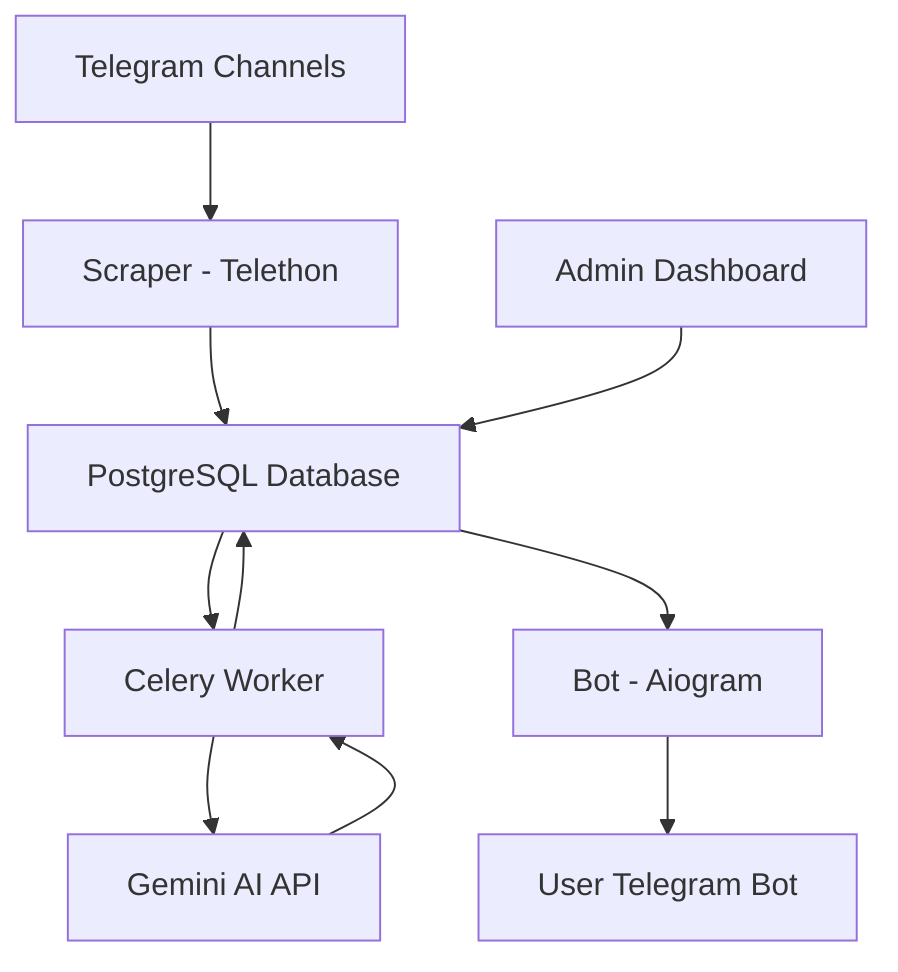

# 🎯 JobLens

**JobLens** is an intelligent, AI-powered system designed to aggregate, process, and deliver high-quality job opportunities from scattered Telegram channels directly to users. 

[](https://t.me/JobLens_AI_Bot)

---

## 🛑 Problem Statement
The modern job market on Telegram is fragmented. High-quality job postings are buried in dozens of channels, often mixed with spam, unrelated content, or duplicates. For a developer or job seeker, monitoring these channels manually is:
- **Time-consuming**: Hours spent scrolling through unrelated posts.
- **Noisy**: Many posts aren't even job descriptions.
- **Unorganized**: No way to filter by tech stack, experience, or relevance.

## 💡 Solution
**JobLens** acts as a centralized brain for Telegram job hunting. It monitors multiple channels in real-time, uses Large Language Models (LLMs) to verify and extract relevant metadata, and matches these jobs with user preferences.

## ✨ Features
- **Real-time Scraping**: Multi-channel monitoring using the Telethon library.
- **AI-Powered Extraction**: Uses **Google Gemini Pro** to distinguish between actual job posts and noise, and to extract structured data (Salary, Tech Stack, Requirements).
- **Intelligent Matching**: Personalized notifications based on user-defined skills and experience levels.
- **Feedback Loop**: Users can mark jobs as "Relevant" or "Not Relevant" to improve the matching engine over time.
- **Admin Dashboard**: Comprehensive Django Admin interface to manage channels and monitor system health.

## ⚙️ How it Works

The JobLens workflow is designed for speed and precision, ensuring you only see the jobs that matter to you.

### 1. User Onboarding
Users interact with the **JobLens Bot** to set up their professional profile. The bot uses a multi-step conversation flow to collect:
- **Core Skills**: Specific technologies and tools (e.g., Python, React, AWS).
- **Target Experience**: Seniority level and years of professional experience.

### 2. Intelligent Ingestion
Once a user adds a Telegram channel via a link or by forwarding a message, the **Telethon Scraper** dynamically joins and monitors it. Every new post is captured in real-time and sent to the backend.

### 3. The Match Engine (Tiered AI)
To balance cost and accuracy, JobLens uses a multi-tier matching strategy:
- **Tier 1 (Gemini Pro)**: The primary engine. It performs deep semantic analysis to extract job details and verify relevance against the user's profile.
- **Tier 2 (NLP Fallback)**: If the AI quota is reached or the service is unavailable, the system falls back to a high-performance NLP engine that uses keyword extraction and scoring.

### 4. Real-time Delivery
When a match is found, the **Aiogram-powered Bot** delivers an instant notification. Users get the full job description, extracted metadata, and a direct link to the original Telegram post.

---

## 🛠️ Tech Stack
- **Backend**: Django (REST Framework)
- **Asynchronous Processing**: Celery + Redis
- **Database**: PostgreSQL
- **Scraper**: Telethon (Telegram MTProto UI)
- **Bot Interface**: Aiogram 3 (Modern Telegram Bot Framework)
- **AI Engine**: Google Gemini API
- **Reverse Proxy**: Nginx
- **Containerization**: Docker & Docker Compose

## 🏗️ Architecture


## 🚀 Getting Started

### Prerequisites
- Docker & Docker Compose
- Telegram API Credentials ([API ID & Hash](https://my.telegram.org))
- Telegram Bot Token ([BotFather](https://t.me/BotFather))
- Google Gemini API Key

### Installation & Setup
1. **Clone the repository**:
   ```bash
   git clone <repository-url>
   cd jobPulse
   ```

2. **Configure Environment Variables**:
   Create a `.env` file in the root directory:
   ```env
   # Telegram
   API_ID=123456
   API_HASH=your_api_hash
   BOT_TOKEN=your_bot_token

   # AI
   GEMINI_API_KEY=your_gemini_key

   # Database
   POSTGRES_DB=jobpulse
   POSTGRES_USER=postgres
   POSTGRES_PASSWORD=postgres
   DATABASE_URL=postgres://postgres:postgres@db:5432/jobpulse

   # Django
   SECRET_KEY=your_django_secret
   DEBUG=True
   ```

3. **Deploy with Docker**:
   ```bash
   docker compose up -d --build
   ```

## 🔑 Environment Variables
| Variable | Description |
| :--- | :--- |
| `API_ID` / `API_HASH` | Telegram API credentials for scraping. |
| `BOT_TOKEN` | Token for the Aiogram bot. |
| `GEMINI_API_KEY` | Key for Google Gemini Pro (AI matching/extraction). |
| `DATABASE_URL` | Connection string for PostgreSQL. |
| `SECRET_KEY` | Django security key. |

## 🔌 API Documentation
The backend provides a RESTful API for managing the system:
- **`GET /api/health/`**: Health check endpoint.
- **`GET/POST /api/job_posts/`**: Manage job listings.
- **`GET/POST /api/channels/`**: Monitor and add Telegram channels.
- **`GET/POST /api/users/`**: Manage bot users and preferences.

## 📁 Folder Structure
```text
.
├── backend/            # Django API, Celery Tasks & AI Matching Logic
│   ├── api/            # API Endpoints
│   ├── apps/           # Domain-specific apps (jobs, users, etc.)
│   ├── core/           # Project configuration (Celery setup)
│   └── shared/         # Shared utilities (AI Cascade, extractors)
├── bot/                # Telegram Bot (Aiogram 3)
├── scraper/            # Telegram Scraper (Telethon)
├── nginx/              # Web Server configuration (Nginx)
├── worker/             # (Placeholder) Potential standalone worker
├── matching_engine/    # (Placeholder) Standalone matching logic
└── docker-compose.yml  # Service Orchestration
```

## 🔮 Future Improvements
- [ ] **Semantic Search**: Implementation of Vector Databases (PGVector) for high-precision job discovery.
- [ ] **Multi-source Aggregation**: Extending scrapers to support LinkedIn, Indeed, and relevant job boards.
- [ ] **Resume Tailoring**: AI-driven tool to help users customize their CVs for specific matched jobs.
- [ ] **Market Analytics**: Dashboard for tracking tech stack demand and salary trends.

## 🔗 Live Link
Check out the live bot on Telegram: **[JobLens Bot](https://t.me/JobLens_AI_Bot)**
